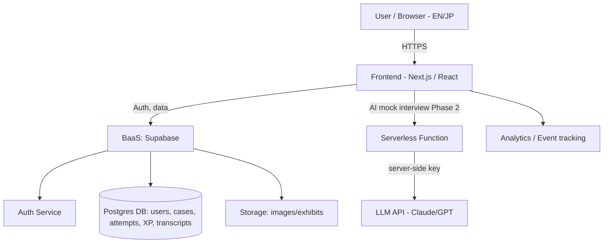

# Product Requirements Document
**Product Name:** Case Dojo *(working name — easily renamed)*
**Author:** Tuan
**Version:** 1.0
**Status:** Draft
**Last Updated:** 2026-06-04
**Stakeholders:** Tuan (Founder / Product / Build), [ASSUMPTION] future contributors — case writers, JP/EN localizers

---

## Table of Contents
1. Executive Summary
2. Problem Statement
3. Goals & Success Metrics
4. Target Users & Personas
5. User Stories
6. Functional Requirements
7. Non-Functional Requirements
8. System Architecture (High-Level)
9. Data & Privacy
10. Dependencies & Integrations
11. Out of Scope
12. Risks & Mitigations
13. Timeline & Milestones
14. Open Questions
15. Appendix

---

## 1. Executive Summary

Case Dojo is a bilingual (English / Japanese), gamified web app that helps students and early-career professionals break into strategy and management consulting — especially MBB (McKinsey, BCG, Bain). It combines four pillars into one place: a tiered **case library** (Easy → Medium → Professional), a **frameworks & fact bank** of reusable structures and market facts, a **gamification layer** (XP, levels, streaks, quizzes, badges) that turns repetitive prep into a habit, and — in later phases — an **AI-powered virtual case interviewer** and a **likely-questions bank** for fit and behavioral prep. The wedge is the Japan-based consulting funnel (Japanese students plus international students like the JIS / Venture Academy community), who today juggle scattered English resources with little Japanese-language support and no structured, motivating practice loop. Case Dojo is free at launch to build an audience and serve as a flagship portfolio product.

---

## 2. Problem Statement

### 2.1 Background
Breaking into MBB and top strategy firms requires mastering case interviews — a skill that is learnable but demands deliberate, repeated practice across many case types (profitability, market entry, M&A, market sizing, etc.), plus fluency with frameworks and a stock of business facts (market sizes, populations, typical margins). The best existing resources are fragmented: expensive 1:1 coaching, dense books, paywalled case banks, and ad-hoc YouTube content. For the Japan-based funnel specifically — Japanese university students and international students aiming at MBB's Tokyo offices — there is very little structured, Japanese-language-supported, motivating practice available in a single product.

### 2.2 The Problem

**Core problem:** Aspiring consultants lack a single, motivating, structured place to build case-interview skill through high-volume practice — and Japan-based candidates lack it in a bilingual form.

**Who experiences it:** University students and early-career professionals (especially in Japan) targeting MBB / strategy / management consulting.

**How they currently cope:** Buying multiple books, paying for coaching, scraping free firm cases and forum threads, practicing with peers inconsistently, and self-tracking progress in spreadsheets.

**Cost of the problem:** Wasted study hours, uneven preparation, low motivation/drop-off, and ultimately failed interviews for a small number of extremely competitive seats. For the builder, an unsolved gap in a market with strong word-of-mouth potential.

### 2.3 Opportunity
Three forces make now the right time: (1) gamified learning (Duolingo-style streaks/XP) has proven it can drive habit formation in skill domains; (2) LLMs now make a credible, low-cost **AI case interviewer** feasible for a solo builder; (3) the Japan consulting funnel is growing and underserved in bilingual prep tooling, giving a defensible, community-anchored beachhead (JIS Alumni, Venture Academy, university consulting clubs).

---

## 3. Goals & Success Metrics

### 3.1 Business Goals

| Goal | Description | Priority |
|------|-------------|----------|
| Build an engaged audience | Establish Case Dojo as the go-to free case-prep app in the Japan funnel | P0 |
| Prove the habit loop | Demonstrate gamification drives repeat practice (retention) | P0 |
| Build founder portfolio / credibility | A flagship, real-users product for consulting/MBA applications | P1 |
| Lay groundwork for future monetization | Architecture and data ready for freemium later | P2 |

### 3.2 User Goals

| User Goal | How We Measure It |
|-----------|-------------------|
| Practice more cases, consistently | Cases attempted per active user per week |
| Feel they are improving | Self-rated confidence delta (pre/post survey); level progression |
| Learn frameworks & facts they can reuse | Framework/fact-bank views per user; quiz accuracy improvement |
| Stay motivated to keep practicing | 7-day and 30-day retention; streak length |

### 3.3 Key Performance Indicators (KPIs)

| KPI | Baseline | Target (3 months) | Target (12 months) | Owner |
|-----|----------|-------------------|--------------------|-------|
| Registered users | 0 | 500 | 5,000 | Founder |
| Weekly active users (WAU) | 0 | 150 | 1,500 | Founder |
| D7 retention | n/a | ≥ 25% | ≥ 35% | Founder |
| D30 retention | n/a | ≥ 12% | ≥ 20% | Founder |
| Avg. cases attempted / WAU / week | 0 | ≥ 3 | ≥ 5 | Founder |
| Median streak length (active users) | 0 | ≥ 4 days | ≥ 7 days | Founder |
| Quiz accuracy improvement (first 10 vs. next 10) | n/a | +10 pts | +15 pts | Founder |

> **Rule applied:** every KPI is measurable with an owner. "More engagement" was rejected in favor of cases/week, streak length, and retention.

---

## 4. Target Users & Personas

### 4.1 User Segments

| Segment | Description | Size Estimate | Priority |
|---------|-------------|---------------|----------|
| Japan-based int'l students | Non-native, strong English, targeting MBB Tokyo (e.g., JIS / Venture Academy / GLOMAC peers) | [ASSUMPTION] ~thousands reachable via communities | Primary |
| Japanese university students | Native JP, varying English, want bilingual support | [ASSUMPTION] larger pool, JP support is the hook | Primary |
| Early-career switchers | Working professionals pivoting into consulting | [ASSUMPTION] smaller, higher intent | Secondary |
| Global self-prep candidates | English-only users found organically | [ASSUMPTION] long-tail via SEO/social | Secondary |

### 4.2 Personas

#### Persona 1: Mai — International Student in Japan
- **Role / Background:** 21, Vietnamese undergrad in a Global Management faculty in Tokyo; strong English, conversational Japanese; active in student associations.
- **Goals:** Land an MBB summer internship; build structured case skill from scratch; track visible progress.
- **Pain Points:** Resources scattered across books/YouTube; hard to know what to practice next; motivation dips when studying alone.
- **Tech Savviness:** High.
- **Usage Context:** 20–40 min sessions between classes and at night; mobile and laptop.
- **Quote:** *"I don't need more PDFs — I need a clear path and a reason to come back tomorrow."*

#### Persona 2: Kenji — Japanese University Student
- **Role / Background:** 22, native Japanese, business major; targeting MBB / strategy firms' Tokyo offices; English is functional but not effortless.
- **Goals:** Practice cases without an English-comprehension penalty; learn the frameworks and the "expected" interview questions.
- **Pain Points:** Most quality case content is English-only; unsure which frameworks actually matter; intimidated by the unknown structure of interviews.
- **Tech Savviness:** Medium.
- **Usage Context:** Evenings/weekends; prefers Japanese UI with English case terms shown.
- **Quote:** *"If I can study in Japanese first and then switch to English, I'll actually keep going."*

#### Persona 3: Sho — Early-Career Switcher
- **Role / Background:** 27, working in a Japanese firm, applying to consulting; limited time.
- **Goals:** Efficient, high-signal prep; realistic mock interviews before the real thing.
- **Pain Points:** No time for a course; needs the AI mock interviewer and a curated "most likely questions" set.
- **Tech Savviness:** Medium-High.
- **Usage Context:** Short, dense sessions; values the AI interviewer most (Phase 2 hook).
- **Quote:** *"I have three weeks. Tell me exactly what to drill and let me rehearse it."*

---

## 5. User Stories

> Format: *As a [user], I want to [action], so that [benefit].* Priority: P0 = MVP must-have, P1 = important, P2 = nice-to-have.

### 5.1 Core User Stories (MVP)

| ID | User Story | Priority | Notes |
|----|-----------|----------|-------|
| US-001 | As a new user, I want to create an account and pick my language (EN/JP), so that the app is usable for me from the start. | P0 | Email + social login |
| US-002 | As a learner, I want to browse cases by type and difficulty (Easy/Medium/Pro), so that I practice at the right level. | P0 | Core content pillar |
| US-003 | As a learner, I want to work through a case step-by-step (prompt → structure → analysis → recommendation), so that I practice the full flow. | P0 | Guided case player |
| US-004 | As a learner, I want a frameworks library (profitability, market entry, M&A, etc.), so that I can apply structures to cases. | P0 | Frameworks pillar |
| US-005 | As a learner, I want a "fact bank" of useful numbers (e.g., US population, market sizes), so that I can sanity-check estimates. | P0 | Fact bank pillar |
| US-006 | As a learner, I want to earn XP and level up by completing cases and quizzes, so that I stay motivated. | P0 | Gamification core |
| US-007 | As a learner, I want a daily streak, so that I build a consistent habit. | P0 | Retention driver |
| US-008 | As a learner, I want quick quizzes (math drills, framework recall, fact recall), so that I sharpen fundamentals fast. | P0 | Quiz engine |
| US-009 | As a learner, I want to see my progress dashboard (cases done, accuracy, level), so that I feel I'm improving. | P0 | Progress view |
| US-010 | As a Japanese-preferring user, I want the UI and case content available in Japanese, so that English isn't a barrier. | P0 | Bilingual content |
| US-011 | As a learner, I want a leaderboard / badges, so that I get social motivation. | P1 | Gamification extension |
| US-012 | As a learner, I want a live AI mock interview that asks me a case, reacts to my answers, gives math prompts, and scores me, so that I rehearse realistically. | P1 | **Phase 2** core feature |
| US-013 | As a learner, I want a bank of likely fit/behavioral questions ("Why consulting?", "Why McKinsey?"), so that I prepare non-case parts too. | P1 | **Phase 3** |
| US-014 | As a learner, I want to bookmark/save cases and frameworks, so that I can revisit weak areas. | P2 | |
| US-015 | As a returning user, I want recommended "next case" based on my weak areas, so that I don't have to plan my study. | P2 | Adaptive path |

### 5.2 Edge Cases & Error States

| ID | Scenario | Expected Behavior |
|----|----------|-------------------|
| US-E01 | User loses connection mid-case | Progress saved locally; resume on reconnect; no XP lost |
| US-E02 | AI interviewer (Phase 2) is rate-limited / API down | Graceful message; fall back to self-guided case mode; no crash |
| US-E03 | User switches language mid-session | UI re-renders in chosen language; case shows translated version if available, else shows EN with a "JP coming soon" label |
| US-E04 | Quiz answer submitted blank/invalid | Inline validation; no XP awarded; prompt to retry |
| US-E05 | Same case completed again | Allowed; reduced/no XP on repeat to discourage farming; marked "reviewed" |
| US-E06 | New user with empty progress | Friendly onboarding + a recommended starter Easy case |

---

## 6. Functional Requirements

> "SHALL" = mandatory, "SHOULD" = recommended, "MAY" = optional.

### 6.1 Accounts & Profile
- **FR-001:** The system SHALL let users register and log in via email and at least one social provider (Google).
- **FR-002:** The system SHALL let users set a preferred language (EN/JP) and change it any time.
- **FR-003:** The system SHALL maintain a user profile storing level, total XP, streak, and progress history.
- **FR-004:** The system SHOULD support a guest/try-without-account mode for one sample case before sign-up.

### 6.2 Case Library & Case Player (MVP — Pillar 1)
- **FR-010:** The system SHALL store cases tagged by **type** (e.g., profitability, market entry, market sizing, M&A, operations) and **difficulty** (Easy / Medium / Professional).
- **FR-011:** The system SHALL present a guided case flow: prompt → clarifying notes → structure/framework step → analysis (incl. quantitative step) → recommendation → model answer / debrief.
- **FR-012:** The system SHALL show a model structure and a sample strong answer for each case after the user attempts it.
- **FR-013:** The system SHALL record each case attempt (case ID, completion, self-rating, time spent) to the user's progress.
- **FR-014:** Each case SHALL carry a clear **source label**: *Original*, *AI-generated*, or *Adapted/External (with attribution + link)*. (See Risk R-001.)
- **FR-015:** The system SHOULD let users filter and search cases by type, difficulty, and completion status.
- **FR-016:** The system SHOULD support a "math/estimation step" with a numeric input and tolerance-based checking.

### 6.3 Frameworks & Fact Bank (MVP — Pillar 1)
- **FR-020:** The system SHALL provide a browsable frameworks library with a short explanation, when-to-use guidance, and a visual for each (profitability tree, Porter's Five Forces, 3C/4P, etc.).
- **FR-021:** The system SHALL provide a searchable "fact bank" of reusable business facts/benchmarks (e.g., country populations, common margins, market-size anchors) with source notes.
- **FR-022:** Each framework and fact entry SHALL be available in both EN and JP (or clearly flagged when a translation is pending).
- **FR-023:** The system SHOULD link frameworks to the case types where they apply most.

### 6.4 Gamification (MVP — Pillar 2)
- **FR-030:** The system SHALL award XP for completing cases, quizzes, and daily activity, with higher XP for higher difficulty.
- **FR-031:** The system SHALL define levels with XP thresholds and SHALL show progress to the next level.
- **FR-032:** The system SHALL track a daily streak and SHALL reset it after a missed day (with an optional streak-freeze, P2).
- **FR-033:** The system SHALL provide quizzes in at least three modes: **math/estimation drills**, **framework recall**, and **fact recall**.
- **FR-034:** The system SHALL display a personal progress dashboard (level, XP, streak, cases by type/difficulty, quiz accuracy trend).
- **FR-035:** The system SHOULD provide badges/achievements for milestones (e.g., "10 market-sizing cases", "7-day streak").
- **FR-036:** The system MAY provide opt-in leaderboards (global and/or community/cohort).
- **FR-037:** The system SHALL reduce or zero out XP for repeated completion of the same case to prevent XP farming.

### 6.5 AI Virtual Case Interviewer (Phase 2 — Pillar 3)
- **FR-040:** The system SHALL provide a live, conversational mock interview where an LLM presents a case, responds to the user's structure and answers, issues math/exhibit prompts, and pushes back like an interviewer.
- **FR-041:** The system SHALL produce a structured score/feedback at the end (e.g., structure, quantitative, communication, synthesis) with concrete improvement tips.
- **FR-042:** The system SHALL support the mock interview in both EN and JP.
- **FR-043:** The system SHALL handle API failures gracefully (FR/US-E02) and SHALL enforce per-user rate/usage limits to control cost.
- **FR-044:** The system SHOULD let users review a transcript of the mock and save it to their progress.

### 6.6 Likely-Questions Bank (Phase 3 — Pillar 4)
- **FR-050:** The system SHALL provide a categorized bank of likely fit/behavioral and firm-specific questions ("Why consulting?", "Why this firm?", PEI-style prompts).
- **FR-051:** The system SHOULD let users draft, save, and self-rate their answers to these questions.
- **FR-052:** The system MAY use the AI (Phase 2 engine) to give feedback on saved answers.

### 6.7 Localization (cross-cutting)
- **FR-060:** The system SHALL provide full UI localization in English and Japanese.
- **FR-061:** Content (cases, frameworks, facts, questions) SHALL support per-item EN and JP versions, with a graceful fallback + "translation pending" label when one is missing.

---

## 7. Non-Functional Requirements

### 7.1 Performance
| Requirement | Threshold |
|-------------|-----------|
| Page load time (p95) | < 2.5 s |
| Core API response (p95) | < 600 ms |
| AI interviewer first-token latency (Phase 2) | < 3 s |
| Concurrent users supported (launch) | ≥ 200 |
| Uptime target | ≥ 99% (free-tier realistic) |

### 7.2 Security
- **Authentication:** Managed auth (email + Google OAuth) via a BaaS provider; password handling delegated to provider.
- **Authorization:** Roles — *User*, *Content Admin* (Tuan), *Reviewer* (future). Content editing restricted to admins.
- **Data encryption:** TLS in transit; encryption at rest via the hosting/BaaS provider's defaults.
- **Compliance:** Japan **APPI** (Act on the Protection of Personal Information) as the primary regime; GDPR-friendly practices for EU users. [ASSUMPTION] no special-category data collected.
- **Abuse/cost protection:** Rate limiting on AI endpoints; server-side key handling so LLM keys are never exposed client-side.

### 7.3 Scalability
- Expected growth: ~500 users (3 mo) → ~5,000 (12 mo).
- Data volume: modest (user progress, attempts, transcripts) — fits comfortably within managed Postgres free/low tiers initially.
- Scaling approach: rely on managed/serverless auto-scaling (BaaS + serverless functions); revisit if AI usage costs grow.

### 7.4 Accessibility
- **Standard:** WCAG 2.1 AA target.
- **Keyboard navigation:** Full support.
- **Color contrast:** ≥ 4.5:1.
- **Screen reader support:** Yes for core flows (case player, quizzes, dashboard).

### 7.5 Localization & Internationalization
- **Languages at launch:** English + Japanese (both primary).
- **Future languages:** [ASSUMPTION] Vietnamese (founder's community) as a likely next addition.
- **Formatting:** Locale-aware dates/numbers; JP/EN typography handled (CJK font support).

### 7.6 Browser / Device Support
| Platform | Minimum |
|----------|---------|
| Chrome / Edge | Latest 2 versions |
| Safari | Latest 2 versions |
| Firefox | Latest 2 versions |
| Mobile web (iOS) | iOS 16+ (responsive web) |
| Mobile web (Android) | Android 10+ (responsive web) |

> Native mobile apps are **out of scope** for v1 (responsive web only).

---

## 8. System Architecture (High-Level)

### 8.1 Architecture Overview
Case Dojo is a web app with a **Next.js (React) frontend**, a **Backend-as-a-Service (e.g., Supabase)** providing managed auth, Postgres database, and file/storage, and **serverless functions** for any custom logic and for proxying the **LLM API** (Phase 2 AI interviewer) so API keys stay server-side. Content (cases, frameworks, facts) is stored in the database and editable by an admin. This stack is deliberately lean to fit a solo builder on free/low-cost tiers, matching the "free for now" goal.

### 8.2 Architecture Diagram

### 8.3 Key Technical Decisions

| Decision | Options Considered | Chosen Approach | Rationale |
|----------|--------------------|-----------------|-----------|
| Frontend | Next.js vs plain React vs Vue | **Next.js** | SSR/SEO for content discovery; familiar; deploys easily |
| Backend | Custom Node API vs BaaS | **BaaS (Supabase)** | Solo builder; managed auth + Postgres + storage; speed |
| AI provider | Claude vs GPT | **LLM API via serverless proxy** [ASSUMPTION] | Keys hidden server-side; cost-controllable; founder has prior experience |
| Hosting | Vercel vs others | **Vercel** [ASSUMPTION] | Native Next.js fit; generous free tier |
| Content store | CMS vs DB tables | **DB tables + admin UI** | Simpler; bilingual fields per item |

> [ASSUMPTION] Stack reflects a solo, low-cost build; confirm before committing.

---

## 9. Data & Privacy

### 9.1 Data Model (High-Level)

| Entity | Key Attributes | Relationships |
|--------|----------------|---------------|
| User | id, email, display_name, lang_pref, level, total_xp, streak, created_at | Has many Attempts, QuizResults, MockSessions, Bookmarks |
| Case | id, type, difficulty, source_label, body_en, body_jp, model_answer | Has many Attempts |
| Framework | id, name, when_to_use, visual_ref, text_en, text_jp | Linked to Case types |
| Fact | id, label, value, source_note, text_en, text_jp | — |
| Attempt | id, user_id, case_id, completed, self_rating, time_spent, xp_awarded | Belongs to User & Case |
| QuizResult | id, user_id, quiz_type, score, accuracy, created_at | Belongs to User |
| MockSession (Phase 2) | id, user_id, case_id, transcript, scores, created_at | Belongs to User |
| Bookmark | id, user_id, item_type, item_id | Belongs to User |

### 9.2 Data Collected

| Data Type | Purpose | Retention | Consent |
|-----------|---------|-----------|---------|
| Email + name | Authentication, account | Until deletion | Yes (signup) |
| Language preference | Localization | Until deletion | Implicit |
| Progress/attempts/XP | Core product, analytics | Until deletion | Yes (privacy policy) |
| AI mock transcripts (Phase 2) | Feedback, review | Until deletion or user-purge | Yes (explicit at first use) |
| Usage events | Product analytics | [ASSUMPTION] 24 months | Yes (privacy policy) |

### 9.3 Privacy Considerations
- **PII handling:** Minimal PII (email, name). Stored via managed BaaS with provider encryption.
- **Data deletion:** Self-serve account + data deletion (right to erasure).
- **AI data:** Transcripts sent to the LLM provider for the mock interview — disclose this clearly and confirm the provider's data-use terms; offer transcript deletion.
- **Third-party sharing:** LLM provider (Phase 2), analytics provider — list in privacy policy.
- **Regulatory:** Japan APPI primary; GDPR-aligned practices for any EU users.

---

## 10. Dependencies & Integrations

### 10.1 External Dependencies

| Dependency | Type | Purpose | Risk if Unavailable |
|------------|------|---------|---------------------|
| BaaS (e.g., Supabase) | Auth/DB/Storage | Core backend | High — blocks app |
| Hosting (e.g., Vercel) | Hosting/CDN | Serve frontend + functions | High — blocks app |
| LLM API (Claude/GPT) | AI | Phase 2 mock interviewer | Medium — Phase 2 only; core still works |
| Analytics (e.g., PostHog/Plausible) | Analytics | KPIs, retention | Low — degrades insight, not UX |
| Google OAuth | Auth | Social login | Low — email login remains |

### 10.2 Internal Dependencies

| System | Dependency | Required By |
|--------|------------|-------------|
| Content pipeline | A stock of quality cases/frameworks/facts in EN+JP | Alpha |
| Translation workflow | EN↔JP content parity | Beta/Launch |
| Admin tooling | Way to add/edit content | Alpha |

### 10.3 API Contracts
- Internal: serverless endpoint for AI mock interview (request: case + conversation state; response: interviewer turn + optional scores). [ASSUMPTION] no public API in v1.

---

## 11. Out of Scope (v1)

- **Native iOS/Android apps** — responsive web only; revisit post-launch.
- **Paid plans / payments** — free for now; architecture stays payment-ready.
- **AI interviewer** — deferred to Phase 2 (not in first MVP shipment).
- **Likely-questions bank** — deferred to Phase 3.
- **Peer-to-peer / live human mock matching** — not in v1.
- **Verbatim hosting of copyrighted firm cases** — explicitly excluded (link out + attribution instead; see R-001).
- **Languages beyond EN/JP** — Vietnamese and others are future.
- **Recruiter/employer-facing features** — not targeted.

---

## 12. Risks & Mitigations

| # | Risk | Likelihood | Impact | Mitigation | Owner |
|---|------|-----------|--------|------------|-------|
| R-001 | **Copyright** — reproducing real published MBB/firm cases verbatim infringes IP | High | High | Do **not** host firm cases verbatim. Use: (a) **original** cases, (b) **AI-generated** cases, (c) for real cases, **link out** to the firm's own published page with attribution and provide your **own original adaptation/commentary**, not a copy. Add a content-source label (FR-014). Get a light legal review before launch. | Founder |
| R-002 | **AI cost blowout** — free product + LLM mock interviews can run up API bills | High | High | Phase the AI feature; server-side rate/usage limits per user; cap daily AI sessions; monitor spend; consider gating heavy AI use behind future paid tier | Founder |
| R-003 | **Content bottleneck** — writing high-quality bilingual cases/frameworks is slow and is the real moat | High | High | Start with a focused MVP set (e.g., 15–20 cases across tiers); reuse AI to draft, human-edit; recruit community contributors; prioritize EN, queue JP | Founder |
| R-004 | **Solo-builder bandwidth** — one person across product, content, code | High | Medium | Ruthless MVP scope; lean stack (BaaS); lean on skills/templates; sequence pillars | Founder |
| R-005 | **Low retention** — common for edu/prep apps after initial novelty | Medium | High | Gamification loop (streaks, XP, levels), recommended-next-case, email/streak nudges; measure D7/D30 from day one | Founder |
| R-006 | **Bilingual parity drift** — JP content lags EN, hurting JP users | Medium | Medium | "Translation pending" fallback (FR-061); prioritize JP for highest-traffic content; track parity % | Founder |
| R-007 | **AI feedback quality** — mock interviewer gives wrong/low-value feedback | Medium | Medium | Constrain with strong rubrics/prompts; show feedback as guidance not gospel; collect thumbs-up/down to improve | Founder |
| R-008 | **Privacy of AI transcripts** | Low | Medium | Disclose LLM data flow; confirm provider terms; allow transcript deletion | Founder |

---

## 13. Timeline & Milestones

### 13.1 Phased Rollout
*(Dates are placeholders — [ASSUMPTION], set against your real availability.)*

| Phase | Description | Target | Features Included |
|-------|-------------|--------|-------------------|
| Phase 0 — Foundations | Auth, data model, admin content tooling, EN/JP scaffolding | Weeks 1–3 | Accounts, localization shell |
| Phase 1 — Content + Gamification (MVP) | The core loop ships | Weeks 4–10 | Case library + player, frameworks, fact bank, XP/levels/streaks, quizzes, progress dashboard (Pillars 1 & 2) |
| Phase 2 — AI Interviewer | Live mock + feedback | Weeks 11–16 | AI virtual case interview (Pillar 3), transcripts, scoring |
| Phase 3 — Questions Bank + Polish | Fit/behavioral prep, badges, leaderboards | Weeks 17–22 | Likely-questions bank (Pillar 4), badges, leaderboards, adaptive "next case" |
| Phase 4 — Post-Launch | Iterate on data; consider monetization/Vietnamese/native apps | Ongoing | Optimizations, freemium readiness |

### 13.2 Key Milestones

| Milestone | Owner | Due | Dependencies |
|-----------|-------|-----|--------------|
| Data model + auth live | Founder | End Phase 0 | — |
| First 15–20 cases (3 tiers) authored EN | Founder | Mid Phase 1 | Content tooling |
| MVP core loop usable end-to-end | Founder | End Phase 1 | Cases + gamification |
| JP localization parity for MVP content | Founder | End Phase 1 | Translation workflow |
| Closed beta with community (JIS/Venture Academy) | Founder | Start Phase 2 | MVP stable |
| AI mock interviewer live with usage caps | Founder | End Phase 2 | LLM proxy + rate limits |
| Public launch | Founder | End Phase 3 | All P0+P1 |

---

## 14. Open Questions

| # | Question | Owner | Status |
|---|----------|-------|--------|
| Q-001 | What's the monthly LLM-cost ceiling you're willing to absorb for the free AI interviewer? | Founder | Open |
| Q-002 | Will you author cases solo, or crowdsource from the community (and how is contributor quality controlled)? | Founder | Open |
| Q-003 | Confirm legal comfort with the "link-out + original adaptation" approach for real firm cases. | Founder | Open |
| Q-004 | Confirm tech stack (Next.js + Supabase + Vercel + LLM proxy) — or your preference. | Founder | Open |
| Q-005 | Which analytics tool for retention/KPIs (PostHog / Plausible / GA)? | Founder | Open |
| Q-006 | Exact level/XP curve and XP values per activity. | Founder | Open |
| Q-007 | Is a Vietnamese version a near-term goal or post-launch? | Founder | Open |
| Q-008 | Should leaderboards be global, community/cohort-based, or off by default for privacy? | Founder | Open |

---

## 15. Appendix

### A. Glossary
| Term | Definition |
|------|------------|
| MBB | McKinsey, BCG, Bain — the top-three strategy consulting firms |
| Case interview | Interview format where candidates solve a business problem live |
| Market sizing | Estimation case (e.g., "how many X are sold in country Y per year") |
| PEI | Personal Experience Interview (McKinsey-style behavioral assessment) |
| Fit/behavioral questions | Non-case questions ("Why consulting?", "Why this firm?") |
| XP | Experience points awarded for activity, driving levels |
| Streak | Consecutive days of activity |
| BaaS | Backend-as-a-Service (managed auth/DB/storage) |
| APPI | Japan's Act on the Protection of Personal Information |

### B. References
- [Design mockups — TBD]
- [Competitive analysis — TBD: e.g., existing case-prep banks/coaching marketplaces]
- [Content style guide for cases — TBD]
- [Technical spec — TBD]

### C. Change Log
| Version | Date | Author | Changes |
|---------|------|--------|---------|
| 1.0 | 2026-06-04 | Tuan | Initial draft |
